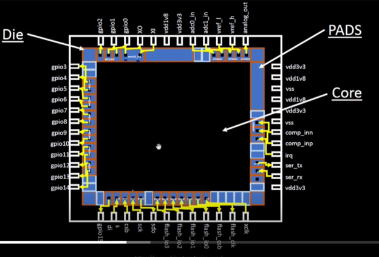
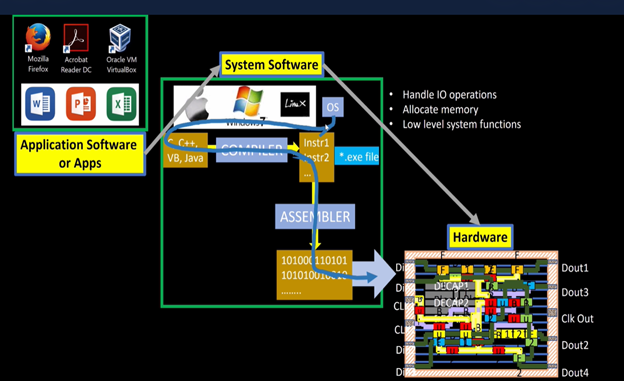
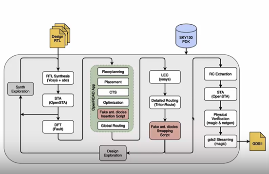
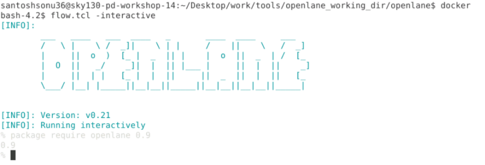
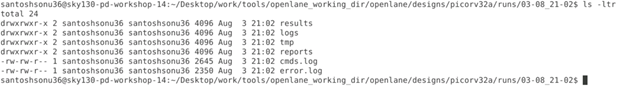
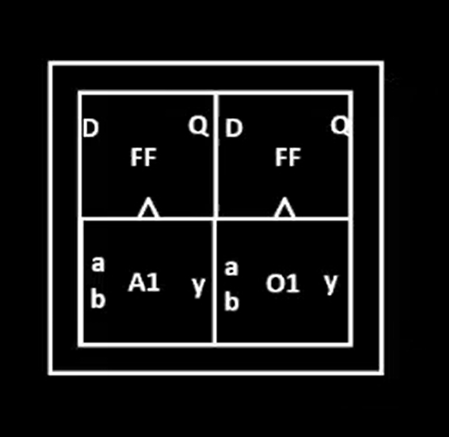
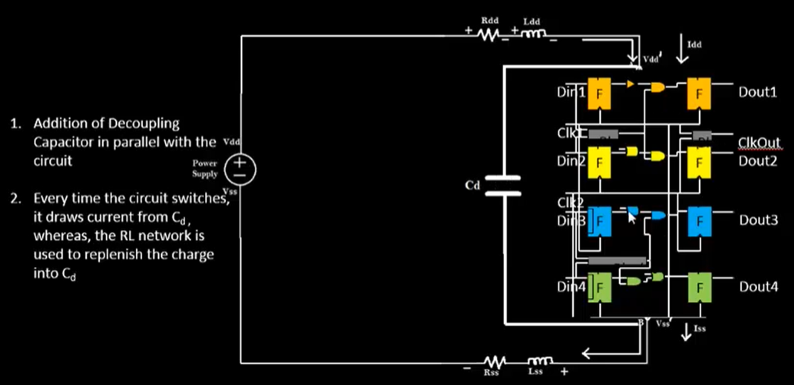
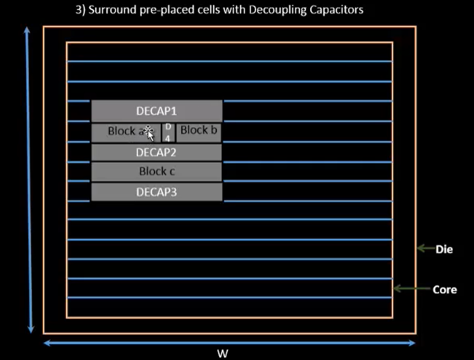

# Advanced-PD-workshop-using-openlane-VSD
## This repo contains all the learnings and labs on Advanced PD workshop by VSD. It contains all the informations on RTL to GDSII implementation of a PICORV32 design using openlane flow.
# Table of content
- [Day 1 Inception of open-source EDA, OpenLANE and Sky130 PDK](#day1-inception-of-open-source-eda-openlane-and-sky130-pdk)
 - [Introduction](#introduction)
 - [Day2: Good floorplan vs bad floorplan]
 - [Day3: Design library cell using Magic Layout and ngspice characterization]
 - [Day4: Pre-layout timing analysis and importance of good clock tree]
 - [Day5: Final steps for RTL2GDS using tritonRoute and openSTA]
 
# Day1: Inception of open-source EDA, OpenLANE and Sky130 PDK
## Introduction:
During ASIC design we will come across some terms more frequenlty few of them are listed below: \
**Pad:** Used to communicate with outside world. \
**Core:** Area where the digital logic sits. \
**Die:** Size of entire chip. \
**Foundry:** Fabrication plant for semiconductor chips. \
**Foundry IP’s:** IP’s supported by foundries. \


## Introduction to RISCV ISA
RISCV ISA: (Reduced Instruction Set computer V) is an open source architecture of processor based on RISC principle also known as instruction set architecture. The hardware runs on low level opcode.
For running a software/app first the software/app informs the system software which has compiler to convert the high level code to instructions then the instruction of given architecture(intel x86, ARM or MIPS) are converted to opcodes using assembler. \


## SoC Design using Openlane:
 

We can see that it follows typical ASIC design flow. Some of its key features are discussed here. Synthesis exploration is where we try various tried and tested strategies on the design and select the strategy with best performance. After that we do STA on the synthesizes netlist followed by DFT insertion using fault tool. Post that physical implementation is done on OpenROAD.

## Openlane Directory sturcture
The tools are at directory ~/Desktop/work/tools. Inside it we have two directories ‘pdk’ and ‘Openlane’.
Pdk directory has 3 directories skywater-pdk: compatible with commercial tools, open-pdk: has scripts to make it compatible with opensource tools and ‘sky130A’ pdk that are compatible with open source EDA tools. Sky130A has 2 directory libs.ref has files specific to the technologies and libs.tech has files specific to the tools. All the libraries can be found at libs.ref.

**Openlane Flow:** Inside Openlane directory parallel to pdk there is a file named flow.tcl.We need to Invoke flow.tcl on docker, which will start the flow and complete the RTL to gdsii flow, using -interactive switch we can interactively control each step of the flow.
Commands used:
```console
docker
flow.tcl -interactive
```

After invoking openlane flow we need to do following steps as a prerequisite to start working on the flow.
•	**Loading the required openlane packages:** 
```console 
package require Openlane 0.9
```
0.9 is the version of openlane
•	**Preparing directory structure:** Here we will set the design name using prep -design {design_name}, there is a directory named design parallel to flow.tcl, which contains all designs, inside any design we will have source file containing .v and .sdc file and configuration file to override default configuration.
```console 
prep -design {design_name} -tag {tag_name} -overwrite
```
If we want to work on a present tag of the design we can specify that using -tag switch.

We can run synthesis using `run_synthesis` command.

After that we can see that inside design directory for the given design there will be runs directory created with files named as the date and time of the run which contains all the information of the run.


  \
Statistics of the synthesized design: \
Area of design: 198775.6416 \
Total cells: 20234 

# Day2: Good floorplan vs bad floorplan
## Deciding utilization ratio and aspect ratio:
If we add the area of all the std cells in the design and make a floor plan with a core size of that number then it will have utilization ratio of 100%. \
 \
Utilization factor is defined as: \
**Utilization factor** = Area occupied by the netlist / total area of core. \
100% utilization is not practical as there is no room left for other cells and routing. \
**Aspect ratio** = Height/ Width of the core
## Defining location of preplaced cells:
What are preplaced cells?
These could be block of digital logic which have can be used multiple times but have more than one logic gates hence we just need to know about its I/O pin usage and use them like a Blackbox provided we know how to use them. Examples of such blocks are IP’s, memories, etc.
The preplace cells are placed based on design details for example if a memory cell has lot of interaction with input ports on the left side it would be better to place them near that port. Once it is placed, we don’t move them in further steps of the flow.
Adding Decap cells to the preplaced cells: The physical wires have physical dimension hence they have resistance, capacitance, and inductance as well. Due to which there will be voltage drop. This voltage drop might cause the output voltage of cells to be low enough to be on the undefined logic region which could be disastrous for the design.
To prevent this phenomena, we add decoupling capacitance: \

As capacitor is an energy storing device it will deliver voltage to the logic near them when the supply voltage is low prevents any voltage drop across the logic. It decouples the circuit from main supply. \

Design with preplaced cells and decap placed around them.
## Power planning: 
We can have many macros, memories or std cells in the design and they can have a huge current demand. We can’t have decoupling capacitor on each of the nets because of Voltage droop and Ground bounce.
Suppose a 16-bit bus is connected to Decap cell then if the logic is inverted then for all the bits transitioning from 0 to 1 will charge the capacitance this will cause droop in power pin and for all bits going from 1 to 0 will discharge capacitance and there will be increase in ground voltage callsed ground bounce.
If there was power supply in each of the cells, then we wouldn’t require decap cells to overcome voltage drop issue.
 
## Pin Placement
In the design apart from the std cells the input and pins are also required to be placed judiciously since good placement of pins can save us routing resources and net delay. It requires a good collaboration between frontend and backend team. 
Post that we need to block the placement of cells outside core area by placement blockage.

## Floorplan using Openlane:
Floorplan is run using ‘run_floorplan’ command when run interactively. It will run with default configuration, we can change it in the configuration directory parallel to flow.tcl. The configuration can be changed in config.tcl or in {pdk name}_config.tcl. The priority is as follow: \
	```console
	Floorplan.tcl << config.tcl << {pdk name}_config.tcl
	``` \
Floorplan was run with changing IO layer number configuration, after the run the def file was generated.


Design with preplaced cells and decap placed around them.
# Day3: Design library cell using Magic Layout and ngspice characterization
# Day4: Pre-layout timing analysis and importance of good clock tree
# Day5: Final steps for RTL2GDS using tritonRoute and openSTA
