# Advanced-PD-workshop-using-openlane-VSD
This repo contains all the learnings and labs on Advanced PD workshop by VSD. It contains all the informations on RTL to GDSII implementation of a PICORV32 design using openlane flow.
# Table of content
- [Day 1 Inception of open-source EDA, OpenLANE and Sky130 PDK](#day1-inception-of-open-source-eda-openlane-and-sky130-pdk)
  - [Introduction to basic IC design terminologies](#introduction)
  - [Introduction to RISCV ISA](#introduction-to-riscv-isa)
  - [SoC Design using Openlane](#soc-design-using-openlane)
  - [Openlane Directory sturcture](#openlane-directory-sturcture)
- [Day2: Good floorplan vs bad floorplan](#day2-good-floorplan-vs-bad-floorplan)
  - [Deciding utilization ratio and aspect ratio](#deciding-utilization-ratio-and-aspect-ratio)	
  - [Defining location of preplaced cells](#defining-location-of-preplaced-cells)
  - [Power planning](#power-planning)
  - [Viewing def file in magic](#viewing-def-file-in-magic)
  - [Binding netlist with physical cells](https://github.com/Santosh3672/Advanced-PD-workshop-using-openlane-VSD/blob/main/README.md#binding-netlist-with-physical-cells)
  - [Congestion aware placement in Openlane using RePlAce](https://github.com/Santosh3672/Advanced-PD-workshop-using-openlane-VSD/blob/main/README.md#congestion-aware-placement-in-openlane-using-replace)
  - [Cell design flow](https://github.com/Santosh3672/Advanced-PD-workshop-using-openlane-VSD/blob/main/README.md#cell-design-flow)
  - [Timing characterization](https://github.com/Santosh3672/Advanced-PD-workshop-using-openlane-VSD/blob/main/README.md#timing-characterization)
- [Day3: Design library cell using Magic Layout and ngspice characterization](https://github.com/Santosh3672/Advanced-PD-workshop-using-openlane-VSD/blob/main/README.md#day3-design-library-cell-using-magic-layout-and-ngspice-characterization)
- [Day4: Pre-layout timing analysis and importance of good clock tree](https://github.com/Santosh3672/Advanced-PD-workshop-using-openlane-VSD/blob/main/README.md#day4-pre-layout-timing-analysis-and-importance-of-good-clock-tree)
- [Day5: Final steps for RTL2GDS using tritonRoute and openSTA](https://github.com/Santosh3672/Advanced-PD-workshop-using-openlane-VSD/blob/main/README.md#day5-final-steps-for-rtl2gds-using-tritonroute-and-opensta)
 
# Day1: Inception of open-source EDA, OpenLANE and Sky130 PDK
## Introduction to basic IC design terminologies:
During ASIC design we will come across some terms more frequenlty few of them are listed below: \
**Pad:** Used to communicate with outside world. \
**Core:** Area where the digital logic sits. \
**Die:** Size of entire chip. \
**Foundry:** Fabrication plant for semiconductor chips. \
**Foundry IP’s:** IP’s supported by foundries. \


## Introduction to RISCV ISA
RISCV ISA: (Reduced Instruction Set computer V) is an open source architecture of processor based on RISC principle also known as instruction set architecture. The hardware runs on low level opcode.
For running a software/app first the software/app informs the system software which has compiler to convert the high level code to instructions then the instruction of given architecture(intel x86, ARM or MIPS) are converted to opcodes using assembler. \


## SoC Design using Openlane:
 

We can see that it follows typical ASIC design flow. Some of its key features are discussed here. Synthesis exploration is where we try various tried and tested strategies on the design and select the strategy with best performance. After that we do STA on the synthesizes netlist followed by DFT insertion using fault tool. Post that physical implementation is done on OpenROAD.

## Openlane Directory sturcture
The tools are at directory ~/Desktop/work/tools. Inside it we have two directories ‘pdk’ and ‘Openlane’.
Pdk directory has 3 directories skywater-pdk: compatible with commercial tools, open-pdk: has scripts to make it compatible with opensource tools and ‘sky130A’ pdk that are compatible with open source EDA tools. Sky130A has 2 directory libs.ref has files specific to the technologies and libs.tech has files specific to the tools. All the libraries can be found at libs.ref.

**Openlane Flow:** Inside Openlane directory parallel to pdk there is a file named flow.tcl.We need to Invoke flow.tcl on docker, which will start the flow and complete the RTL to gdsii flow, using -interactive switch we can interactively control each step of the flow.
Commands used:
```console
docker
flow.tcl -interactive
```

After invoking openlane flow we need to do following steps as a prerequisite to start working on the flow.
•	**Loading the required openlane packages:** 
```console 
package require Openlane 0.9
```
0.9 is the version of openlane
•	**Preparing directory structure:** Here we will set the design name using prep -design {design_name}, there is a directory named design parallel to flow.tcl, which contains all designs, inside any design we will have source file containing .v and .sdc file and configuration file to override default configuration.
```console 
prep -design {design_name} -tag {tag_name} -overwrite
```
If we want to work on a present tag of the design we can specify that using -tag switch.

We can run synthesis using `run_synthesis` command.

After that we can see that inside design directory for the given design there will be runs directory created with files named as the date and time of the run which contains all the information of the run.


  \
Statistics of the synthesized design: \
Area of design: 198775.6416 \
Total cells: 20234 

# Day2: Good floorplan vs bad floorplan
## Deciding utilization ratio and aspect ratio:
If we add the area of all the std cells in the design and make a floor plan with a core size of that number then it will have utilization ratio of 100%. \
 \
*Design with 100% utilization* \
Utilization factor is defined as: \
**Utilization factor** = Area occupied by the netlist / total area of core. \
100% utilization is not practical as there is no room left for other cells and routing. \
**Aspect ratio** = Height/ Width of the core
## Defining location of preplaced cells:
What are preplaced cells?
These could be block of digital logic which have can be used multiple times but have more than one logic gates hence we just need to know about its I/O pin usage and use them like a Blackbox provided we know how to use them. Examples of such blocks are IP’s, memories, etc.
The preplace cells are placed based on design details for example if a memory cell has lot of interaction with input ports on the left side it would be better to place them near that port. Once it is placed, we don’t move them in further steps of the flow.
Adding Decap cells to the preplaced cells: The physical wires have physical dimension hence they have resistance, capacitance, and inductance as well. Due to which there will be voltage drop. This voltage drop might cause the output voltage of cells to be low enough to be on the undefined logic region which could be disastrous for the design.
To prevent this phenomena, we add decoupling capacitance: \

As capacitor is an energy storing device it will deliver voltage to the logic near them when the supply voltage is low prevents any voltage drop across the logic. It decouples the circuit from main supply. \
 \
Design with preplaced cells and decap placed around them.
## Power planning: 
We can have many macros, memories or std cells in the design and they can have a huge current demand. We can’t have decoupling capacitor on each of the nets because of Voltage droop and Ground bounce.
Suppose a 16-bit bus is connected to Decap cell then if the logic is inverted then for all the bits transitioning from 0 to 1 will charge the capacitance this will cause droop in power pin and for all bits going from 1 to 0 will discharge capacitance and there will be increase in ground voltage callsed ground bounce.
If there was power supply in each of the cells, then we wouldn’t require decap cells to overcome voltage drop issue.

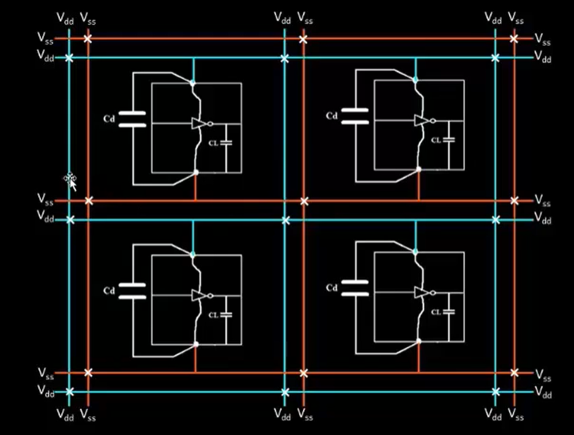 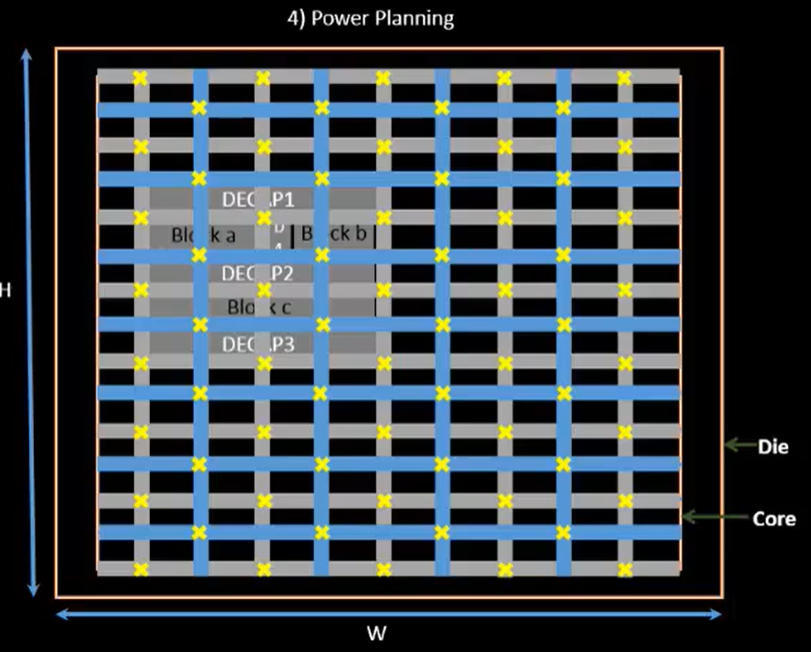
## Pin Placement
In the design apart from the std cells the input and pins are also required to be placed judiciously since good placement of pins can save us routing resources and net delay. It requires a good collaboration between frontend and backend team. 
Post that we need to block the placement of cells outside core area by placement blockage.

## Floorplan using Openlane:
Floorplan is run using ‘run_floorplan’ command when run interactively. It will run with default configuration, we can change it in the configuration directory parallel to flow.tcl. The configuration can be changed in config.tcl or in {pdk name}_config.tcl. The priority is as follow: \
	```console
	Floorplan.tcl << config.tcl << {pdk name}_config.tcl
	``` \
Floorplan was run with changing IO layer number configuration, after the run the def file was generated.

 \
The DEF files is shown below, it is a large file with around 37k lines. \
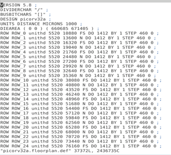 \
1 micron = 1000 database unit. So area of die = (660685/1000 um) * (671405/1000 um) = 443587.2124 um sq. \
Visual representation of FP picorv32a.floorplan.def.png generated by run_floorplan. \
 \
## Viewing def file in magic:

Command used: 
```console
magic -T ~/Desktop/work/tools/openlane_working_dir/pdks/sky130A/libs.tech/magic/sky130A.tech lef read ../../tmp/merged.lef  def read picorv32a.floorplan.def &
```
-T option takes techlef file, \
lef read taked the merged.lef files that was generated while starting Openlane has cell and layer information. \
Def read takes the current floorplan def file.  \
 \
 \
Design after floorplan
 \
Decap cells and Tap cells in the design

## Binding netlist with physical cells:
All logic gates are physically shaped as a rectangle be it an AND gate, Mux or D FF. This information is stored in libraries that contain physical information as well as timing, noise and other necessary information required for implementation. It also contains different variations of a single logic gate like different size(drive strength), speed, threshold voltage(vt), etc. 
After floorplan we need to place the netlist in the core, so we need to bind the netlist with physical cells. Then we can place those physical cells on the core. This placement also needs to be done judiciously based on the design so that cells that are communicating more with a port or block are placed nearby this will save routing resource, avoid congestion and reduce delay to meet timing. \
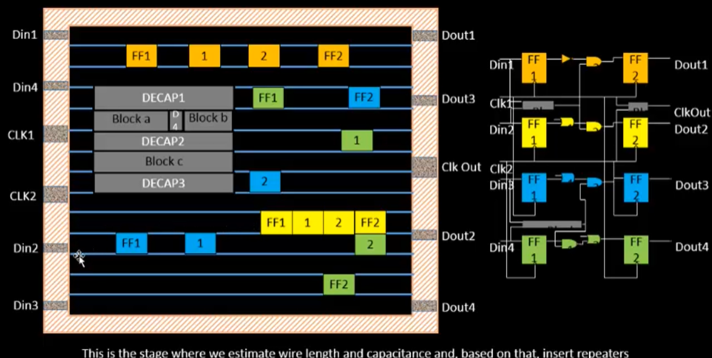 

On above figure we have design on right and placement of gates on right. For orange and yellow FF, the placement was easy as its input and output ports are on the same row. For blue and yellow FF, it is difficult as their input and output pins are placed diagonally opposite. For green FF it has additional problem due to a preplaced block.
For long wire between two pins, we can add repeaters(buffer) to maintain signal integrity. For example, here we can add one or two buffer between Din2 and yellow FF1. Post that the timing is checked to see if the placed design can run at the desired frequency. Here we assume clocks to be ideal and check setup timing. 
Based on the timing results we can either modify the placement or add buffers.
Library Characterization and modelling:
In synthesis we convert RTL to logic gates then move to floorplan placement all the way to signoff. In all these steps the standard cells are common. The libraries are provided with various models that can be understood by all the tools in PD flow.

## Congestion aware placement in Openlane using RePlAce:
Placement occurs in two stage global and detailed placement. The placement algorithm tries to reduce half parameter wire length. Placement is run using `run_placement` command. 
To view placed design in magic tool use below command:
```console
magic -T ~/Desktop/work/tools/openlane_working_dir/pdks/sky130A/libs.tech/magic/sky130A.tech lef read ../../tmp/merged.lef def picorv32a.placement.def
```
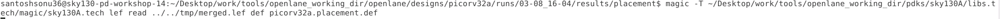 


Placed design in magic tool. \
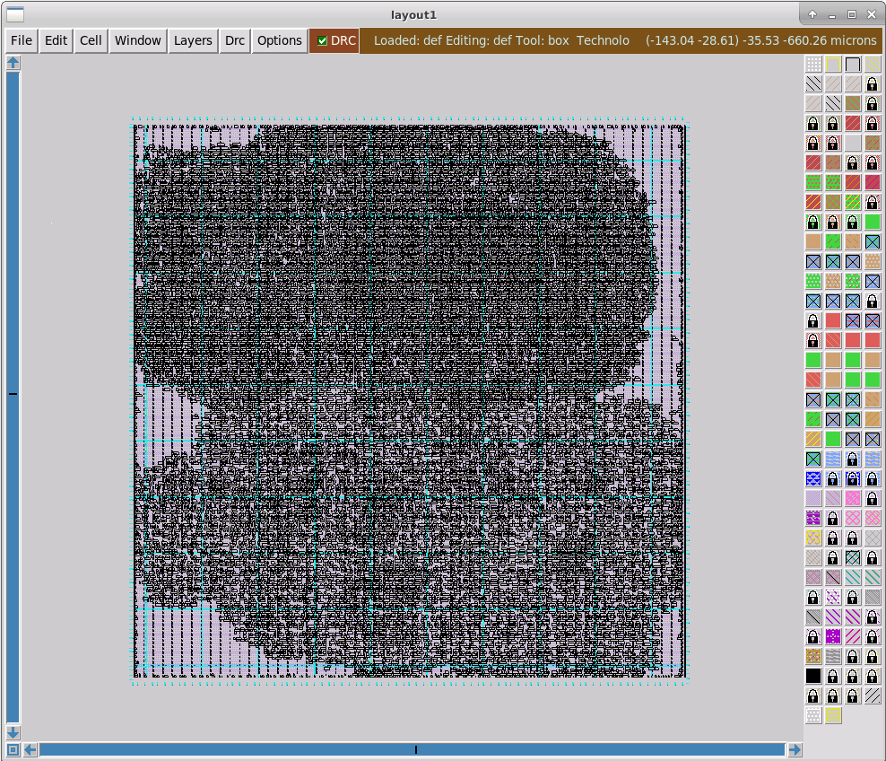 \
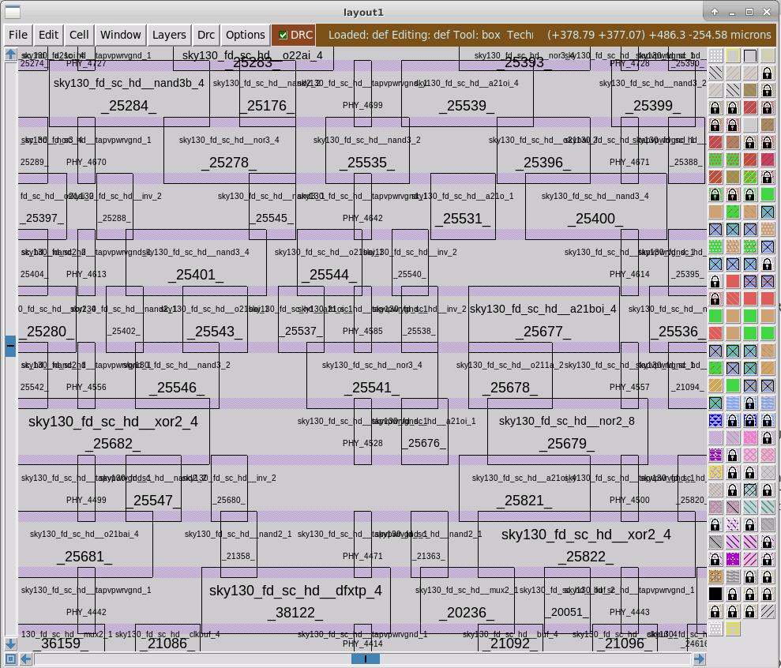 \
We can see endcap cells, tap cells, std cells, and pg grid being made. 

## Cell design flow:

As discussed earlier we have library of the std cells with different varieties and each have multiple models for different tools. The cell design flow is discussed here. \
 \
For cell design flow we need inputs those are PDKs, DRC & LVS rules (required by foundry), SPICE models (with all physical parameters), library and user defined specs.
Dimension of cell: the height of the cell should be same for all cells so that VSS and VDD will be laid. Width of the cell can be varied wider cells for high drive strength cells. \
Supply voltage: It will be determined by the user (top level designer) and cell designer has to design cells based on that voltage. \
Metal layers: It could be on M1 or M2 or M3 based on user requirement. \
Then based on the given input cell designer will start designing cell. Designer does spice simulation to design circuit like makil w/l of pmos double w/l of nmos, selecting w/l ratio for desired Id value. After which CDL(circuit descriptive language) is given as output.  \
Post that layout design will start. To design layout we first get the CMOS design of the circuit with PMOS and NMOS. Then derive the graphs of PMOS and NMOS network as shown below. \
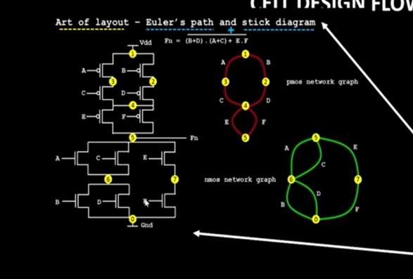 \
Here we are discussing about Euler’s path + stick diagram method which gives layout with best performance and best area. In this method after we derive network graph we derive Euler’s path which is the path that is traversed once. For above example it is A-C-E-F-D-B. \
Then we create a stick diagram of the order of Euler’s path and make connection according to the design. Post that we convert it to layout while adhering to the foundry rules and user input rules. \
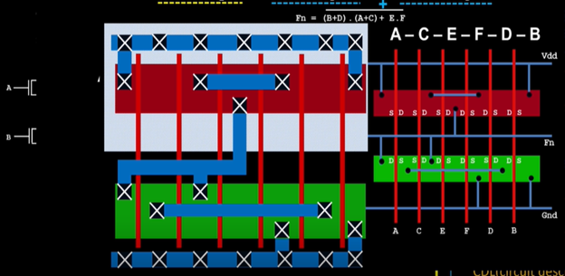 \

With the final layout completed we will produce its GDSII, LED and extract its spice netlist (.cir).
After layout we need to the do cell characterization. Steps included in this process are:
1.	Read the model files 
2.	Read the extracted spice netlist
3.	Recognize the behavior of the cell
4.	Read the subcircuit of the cell
5.	Attach the necessary power source
6.	Apply the required stimulus.
7.	Provide necessary output capacitance
8.	Provide necessary simulation command (transient, DC, AC simulation)

After all these steps we feed the configuration file to a characterization software called GUNA which will generate timing, power and noise characterization. 

## Timing characterization

In timing characterization we need to know the variables with which the GUNA software will model the cell, those variables are related to input waveform like:
1. slew_low_rise_thr
2. slew_low_fall_thr 
3. slew_high_rise_thr
4. slew_high_fall_thr 
5. in_rise_thr
6. in_fall_thr 
7. out_rise_thr 
8. out_fall_thr

They contain the value at which we need to calculate the slew rate or delay. \
For example we need to calculate the propagation delay for falling edge of a buffer and in_fall_thr and out_fall_thr are 50% each then we need to subtract the time when output is 50% with the time where input is 50%.  If we want to calculate delay from 40% of in_rise_thr then we can change this variable in GUNA configuration. Correct choice of delay is very important else we could get negative delay due to different slew rate of input and output. \
For example, to calculate transition time we subtract time on slew_high__rise_thr with time on slew_low_rise_thr. 

# Day3: Design library cell using Magic Layout and ngspice characterization
## 16 mask CMOS fabrication process
It is a detailed process that is followed to fabricate CMOS circuits. It starts from p-substrate then on it various layers are laid followed by mask layer which mask certain part of the subsrtate on the exposed part of the mask UV rays are passed to remove certain layers. The process is repeated for 16 times as the name says after which we have both PMOS and NMOS creates as well as the routing metals above them are also created. \
The whole process is very long and has been documented in a separate github repo: https://github.com/Santosh3672/16-mask-CMOS-fabrication-process \
## SPICE simulation of standard cells:
For SPICE simulation of any cell, first we need to create the spice deck which contains following information: \
•	Input and output pin connection and connectivity between nmos, pmos, capacitances, etc. \
•	Component values such as value of capacitances, W and L value. Input, output and supply voltage value is also defined. \
•	Identify nodes: nodes are points between which we have devices or passive elements. \
•	Naming of the nodes.  \
Based on node names and component names and their values we can write the spice model in text which can be understood by the tool. \
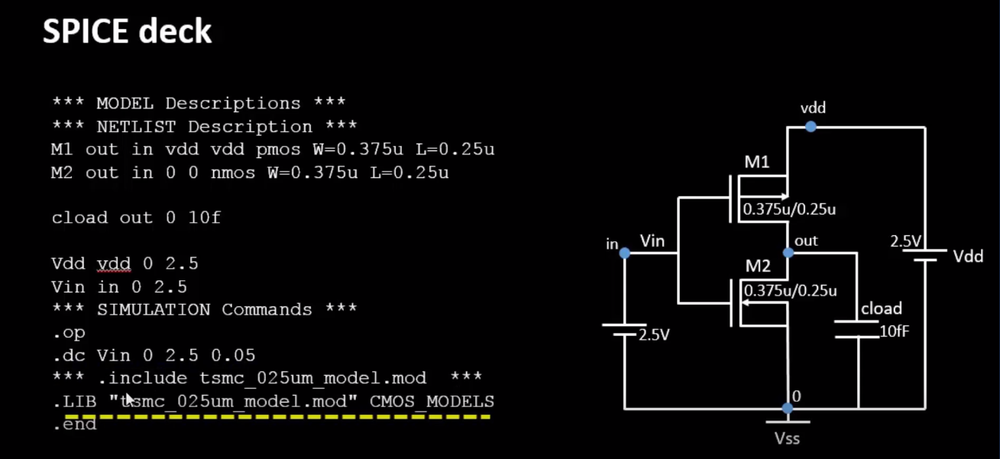 \
In above example we can see circuit of inverter with all components values and nodes named. With those names and values the SPICE we defined the circuit textually followed by defining the input and output voltages and simulation environment. It is followed by calling spice library model from foundry that contains all the physical parameters required for simulation. \
In CMOS the mobility of n carries is more than p type hence we need to have higher Wp/Lp than Wn/Ln so that switching threshold will be half of the Vin. It is required to equalize the rise and fall delay. \
*Switching threshold (Vm):* It is the point where the DC characteristics of CMOS intersects with Vin = Vout curve. \
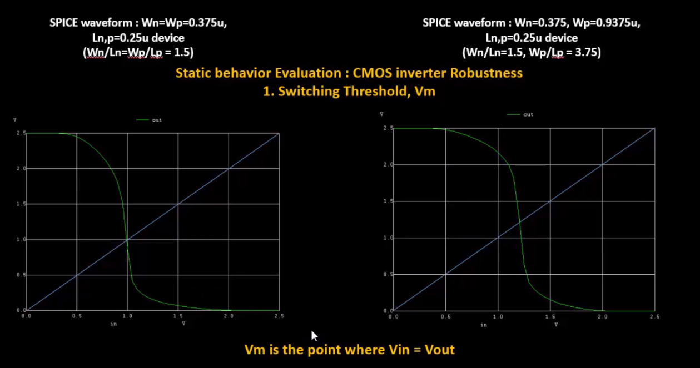 \
VSD cell design github repository: https://github.com/nickson-jose/vsdstdcelldesign

## Inverter design using openlane:
The nwell and pwell contact are made to Local interconnect using nsubstratecontact and psubstratecontact respectively and LI are connetcet to M1 using licon. Then as per above theory we have built the cell layout we need to ensure there are no DRC issue. \
Then we need to ensure that the cell is functioning as we want we can do it using SPICE modelling in ngspice. For that we need to extract parasitics from layout. By creating ext file on magic command is `extract all`. Which is followed by setting threshold R and C using `ext2spice cthresh 0 rthresh 0`. Then we create the spice file using `ext2spice` command. \
```console
	extract all
	ext2spice cthresh 0 rthresh 0
	ext2spice
```
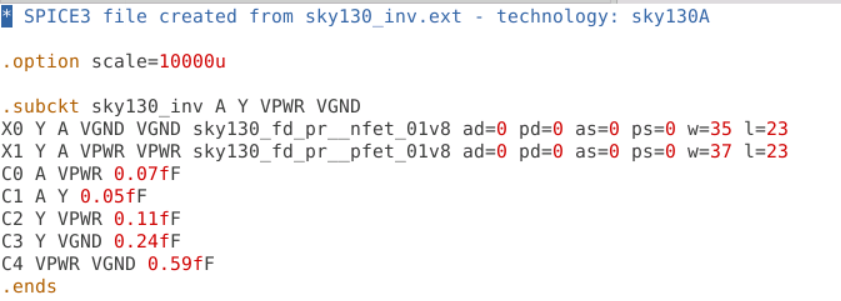 \
Spice file created from magic layout tool for ngspice analysis \
\
Here the input voltage and supply voltages are not defined as they were not defined in magic tool. Also the model files of mos are to be defined that came with the github repo. For simulation we also need to define the simulation type in the spice netlist. After which the SPICE file looks like: \
 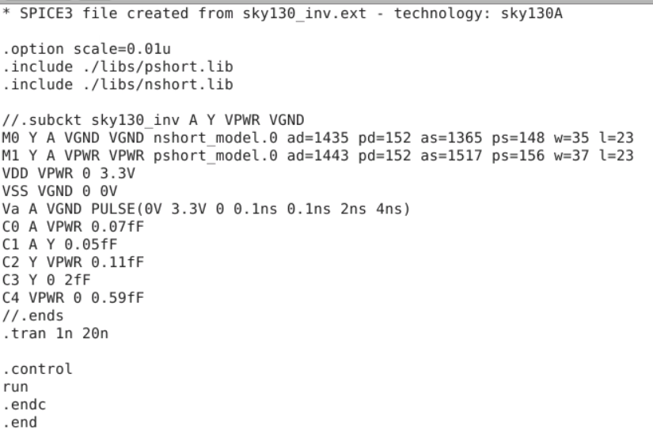 \
\
Now we are ready to run spice simulation we can invoke ngspice using `ngspice {spice_file_name}`.
On ngspice terminal we can plot IO curves using `plot y vs time a` command:
```console
	ngspice {spice_file_name}
	plot y vs time a
```
 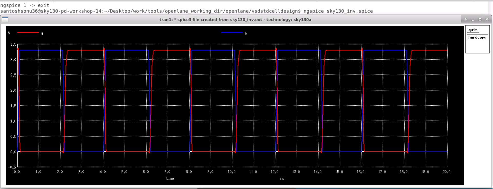 
## Cell characterization from NGspice waveform:
*Rise transition:* Time taken by rising signal at 20% = 2.181 ns \
		Time taken by rising signal at 80% = 2.245 ns \
Rise transition = (2.245-2.181) ns. = 64 ps. \
Similarly, *fall transition* = 4.095 ns - 4.052 ns = 43 ps. \
\
*Propagation delay fall* = 4.077ns – 4.05ns = 27ps \
*Rise delay* = 2.21ns – 2.15ns = 60ps \


# Day4: Pre-layout timing analysis and importance of good clock tree
# Day5: Final steps for RTL2GDS using tritonRoute and openSTA
